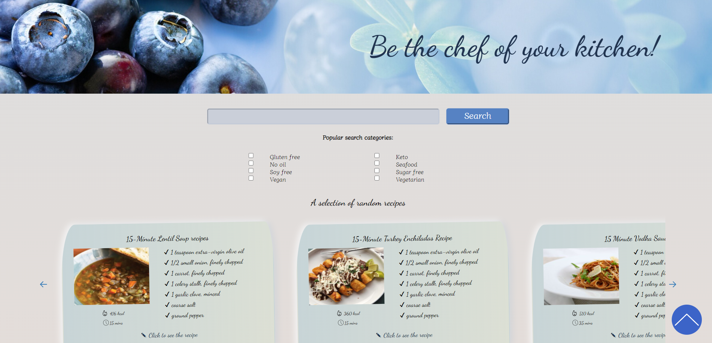
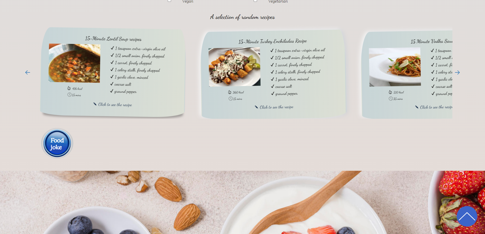
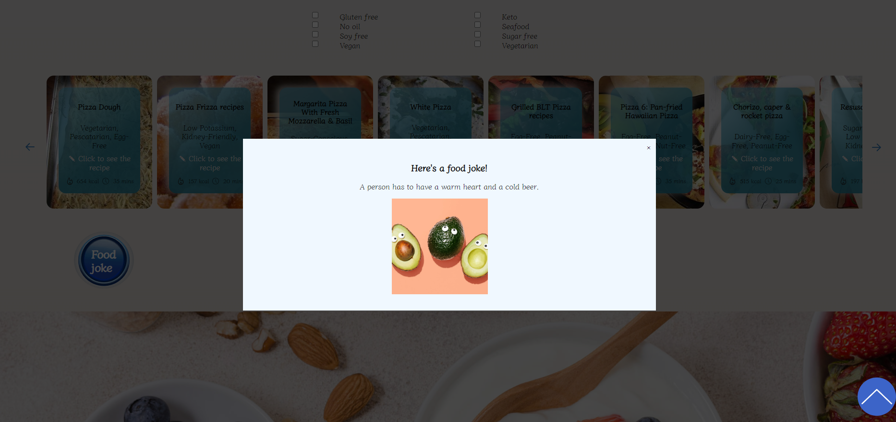

# Yummy - a website for proper nutrition.  
A website with a variety of recipes for proper nutrition. You can search recepies by typing key words in the search area or using filters. Also there is a Joke button on the page, which would show you a random joke from API every time you click on it.

## Technologies:
<code></code>
<code></code>
<code></code>

## Thanks to all Contributors

## Result
https://[github.com/zvezdynya/JS_project](https://yanakin394.github.io/JS_project/)

Some of the parts are still to be worked on
- loaders
- search by filters
- random cards position on smaller resolution
